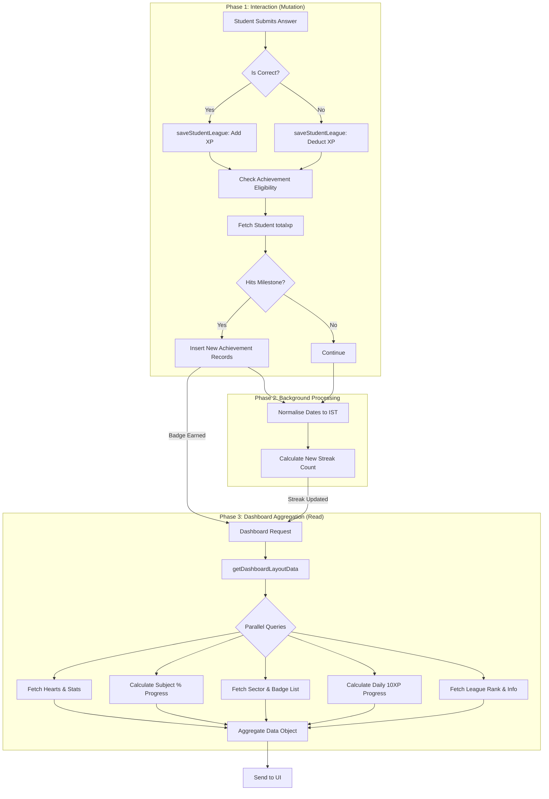
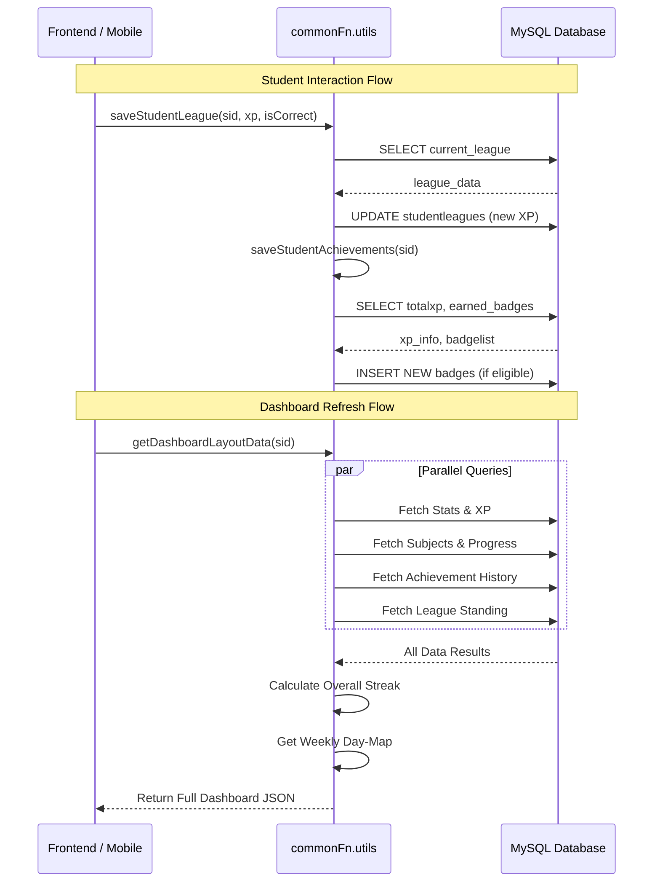

# logic Diagram: `commonFn.utils.js` Full System

This document contains a comprehensive sequence and logic diagram showing exactly how the student engagement engine operates from start to finish.

## 1. Complete System logic Chart
This diagram tracks a student's journey from answering a question to seeing their updated status on the dashboard.

## 2. Sequence Diagram (Data Flow)
This diagram shows the order of operations between the Application, the Utility Functions, and the Database.

---

## 3. Key Logic Branching
| Event | Trigger | Condition | Result |
| :--- | :--- | :--- | :--- |
| **League Update** | `saveStudentLeague` | `iscorrect = true` | `XP = XP + Rewards` |
| **League Penalty** | `saveStudentLeague` | `iscorrect = false` | `XP = max(0, XP - Rewards)` |
| **Achievement** | `saveStudentAchievements` | `minxp <= totalxp <= maxxp` | New row in `studentachievements` |
| **Streak Break** | `getOverallStreak` | `PrevDay` missing in Activity | Streak resets/stops at current count |
| **Daily Goal** | `getDashboardLayoutData` | `TodayXP >= 10` | `dailyProgressPercent = 100%` |
