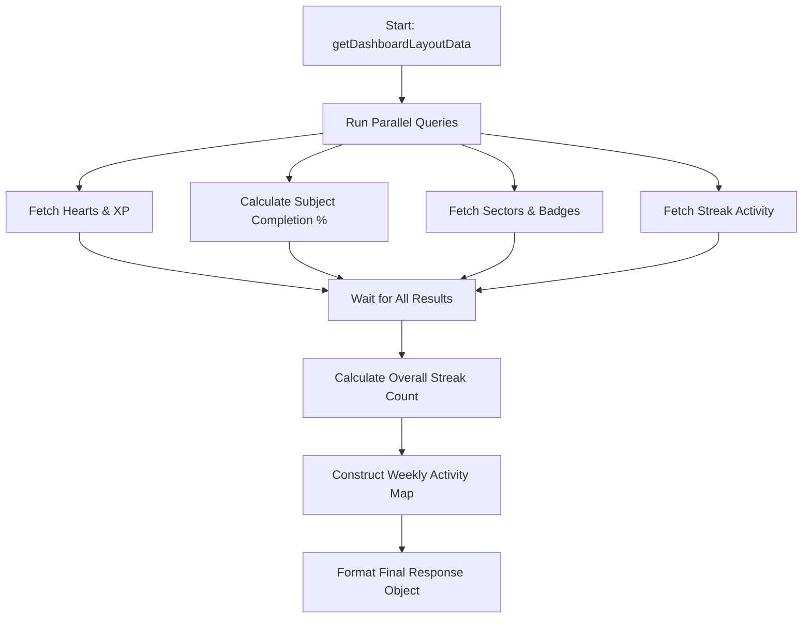
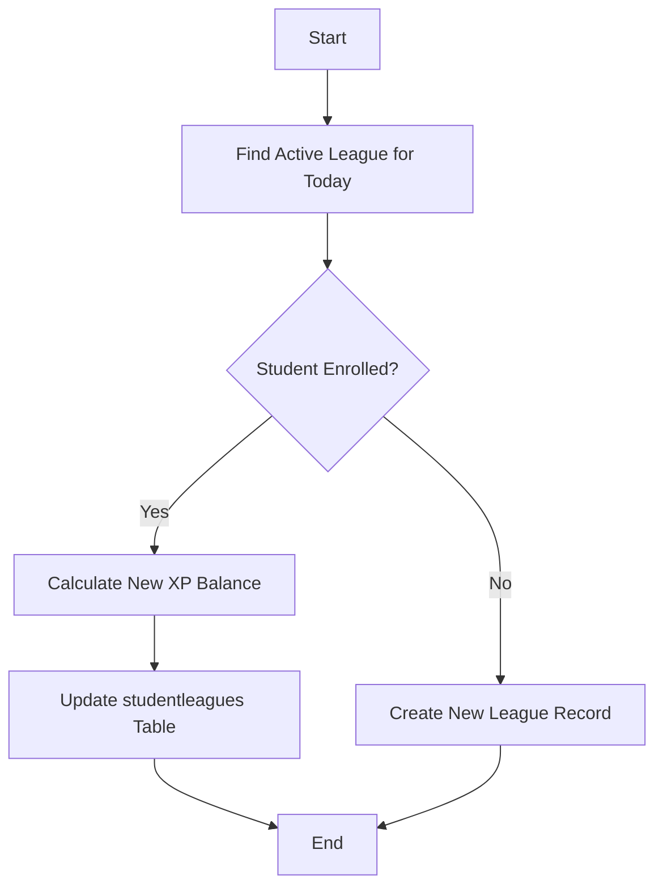
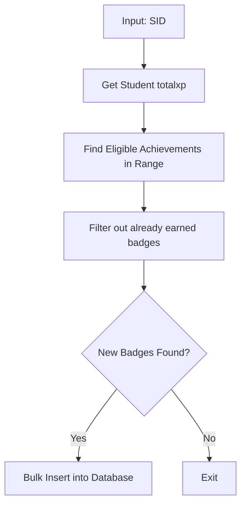
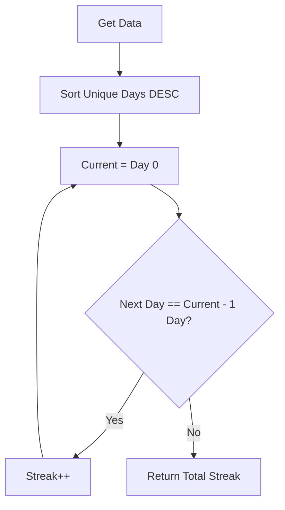

# Documentation: `commonFn.utils.js`

This file provides the full logic flow and visual diagrams for all utility functions in `src/utils/commonFn.utils.js`.

---

## 1. getDashboardLayoutData (Dashboard Aggregator)
Aggregates all student data required for the main dashboard view.

### Flow Logic:
1.  **Input:** Takes a student ID (`sid`).
2.  **Parallel Execution:** Initiates multiple database queries simultaneously using `Promise.all`:
    *   **Student Stats:** Hearts, Total XP, and Today's XP.
    *   **Subject Progress:** Calculates % completion for each active subject accurately by comparing answered questions vs. total available questions in that subject.
    *   **Sectors:** Retrieves a list of sectors along with the count of subjects in each.
    *   **Achievements:** Fetches the most recent 20 badges the student has earned.
    *   **League:** Gets current active league name and rewards.
    *   **Streak History:** Fetches raw timestamps of correct responses.
3.  **Data Processing:**
    *   Calculates **Overall Streak** by counting consecutive days backwards from today.
    *   Generates **Weekly Streak Map** (Sun-Sat) to show active days visually.
    *   Calculates **Daily Challenge %** based on a 10XP goal.
4.  **Output:** Returns a comprehensive JSON object for the frontend.

### Flow Diagram:

---

## 2. saveStudentLeague
Updates a student's standing in the current active league.

### Flow Logic:
1.  Fetches the league that covers the **current timestamp**.
2.  Checks `studentleagues` table to see if the student has a record for this league.
3.  **If Enrolled:** Updates XP rewards. (Logic: `existingXP + newXP` if correct, else `max(0, existingXP - deduct)`).
4.  **If Not Enrolled:** Inserts a new record with initial XP.

### Flow Diagram:

---

## 3. saveStudentAchievements
Automatically awards badges/achievements based on XP milestones.

### Flow Logic:
1.  Fetches student's current `totalxp`.
2.  Fetches all achievements from the `achievements` table where `minxp <= studentXp <= maxxp`.
3.  Compares this with the student's **already earned** achievements.
4.  Filters only "new" achievements and bulk-inserts them into `studentachievements`.

### Flow Diagram:

---

## 4. getTotalSteaks
Calculates the total consecutive day count for a student.

### Flow Logic:
1.  Fetches all unique days with a correct response, sorted descending.
2.  Initializes streak to 1.
3.  Loops through the days:
    *   Subtracts 1 day (86,400,000ms) from the "current day" in the streak.
    *   Checks if the next date in the list matches this subtracted value.
    *   If yes: Increment streak and move to next day.
    *   If no: The streak is broken.
4.  Returns the final count.

### Flow Diagram:

---

## 5. getWeeklyCompletedLevelsActivity
Creates a summary of levels completed in the current IST week.

### Flow Logic:
1.  Gets IST week range (Mon-Sun).
2.  Queries `studentreponse` joined with `levelmapping`.
3.  Aggregates total questions vs. answered questions per level.
4.  Filters levels where all questions were answered correctly.
5.  Formats time labels (e.g., "Today", "Yesterday").

---

## 6. Database Helper Functions
*   **getIstDate**: Normalizes server time to Indian Standard (+5:30).
*   **getWeekRangeIST**: Calculates Sunday/Monday logic for week-based statistics.
*   **parseIsoDate**: Safely converts any input into a `YYYY-MM-DD` string.
*   **getPrevIsoDate**: Utility to step backwards by precisely one calendar day.
