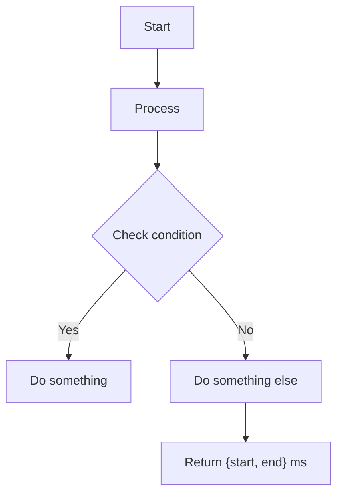
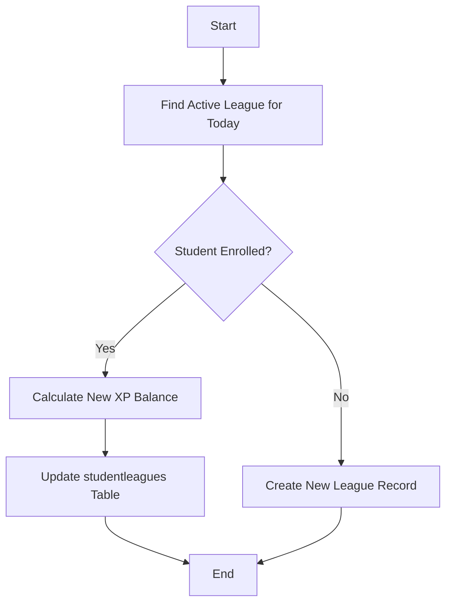
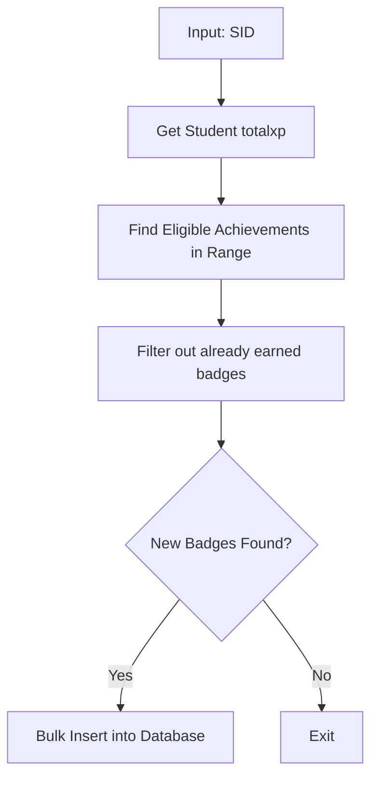
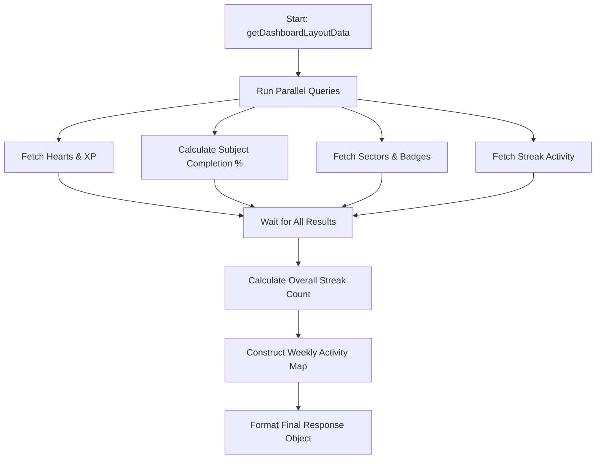

# Documentation: `commonFn.utils.js`

This file provides the full logic flow and visual diagrams for **every single function** in `src/utils/commonFn.utils.js`.

---

## 1. getWeekRangeIST
Calculates the start and end of the current week (Monday to Sunday) in Indian Standard Time (IST).

### Flow Logic:
- Determines the current day (0-6).
- Calculates the offset to get to the preceding Monday.
- Sets `weekStart` to Monday at 00:00:00 local IST.
- Sets `weekEnd` to exactly 7 days after `weekStart`.
- Returns both as millisecond timestamps.

---

## 2. getIstDate
Converts any given date or the current time to Indian Standard Time (UTC+5:30).

### Flow Logic:
- Gets the UTC time in milliseconds.
- Adds the 5.5-hour offset (5 * 60 + 30 minutes).
- Returns a new Date object normalized to IST.

---

## 3. getIsoDateString
Converts a date to a clean `YYYY-MM-DD` string, ensuring it is first converted to IST.

---

## 4. parseIsoDate
A robust parser that accepts Strings, Date objects, or Numbers and converts them to a standard `YYYY-MM-DD` format.

---

## 5. getPrevIsoDate
Returns the `YYYY-MM-DD` string for the day immediately before the input date.

---

## 6. getWeekStreakDays
Generates an array representing the 7 days of the current week (starting Sunday), marking which days were completed.

### Flow Logic:
1.  Calculates the UTC/IST Sunday of the current week.
2.  Iterates 7 times (once for each day).
3.  Calculates the start-of-day timestamp for each day.
4.  Checks if that timestamp exists in the `completedDateSet`.
5.  Returns an array of objects: `{ day, name, date, completed }`.

---

## 7. getOverallStreak
Calculates a continuous streak count by checking if the preceding day exists in a set of dates.

### Flow Logic:
1.  Takes an array of date strings.
2.  Unique-fills and sorts them descending (most recent first).
3.  Loops recursively: checks if `getPrevIsoDate(current)` exists in the set.
4.  Continues until a gap is found.
5.  Returns total count.

---

## 8. saveStudentLeague
Updates or inserts a student's standing in the currently active league.

### Flow Logic:
1.  **Identify League:** Finds the current active league from the DB where `currentDate` is between `fromdate` and `todate`.
2.  **Check Enrollment:** Queries `studentleagues` for the student's ID and current league ID.
3.  **Update Logic:** 
    *   If correct: `existingXP + newXP`.
    *   If wrong: `max(0, existingXP - newXP)`.
4.  **Database:** Performs either an `UPDATE` or `INSERT` based on enrollment status.

---

## 9. getStudentLeague
Retrieves the student's current league status and determines their "Level" (e.g., Bronze, Silver) based on XP.

### Flow Logic:
1.  Fetches active league and the student's entry in `studentleagues`.
2.  Parses the `leaguepoints` JSON from the league definition.
3.  Matches the student's `xprewards` against the `minxp/maxxp` ranges in that JSON.
4.  Returns the student's data along with their current level index and point range.

---

## 10. saveStudentAchievements
Checks for and awards new badges/achievements based on XP milestones.

### Flow Logic:
1.  Fetches student's current `totalxp` from `studentdetails`.
2.  Queries the `achievements` table for any badges where the student's XP falls within the `minxp/maxxp` range.
3.  Queries `studentachievements` to see which ones they ALREADY have.
4.  Filters only the ones they don't have yet.
5.  **Bulk Insert:** Saves all new achievements into the DB in one command.

---

## 11. getStudentAchievements
Fetches a list of all active badges/achievements earned by a student, joined with the main `achievements` table to get Titles and Types.

---

## 12. getHeartData
Fetches the global configuration for the "Hearts" system (life system) from the `hearts` table.

---

## 13. getTotalSteaks
Calculates the total consecutive day count for a student based on correct responses.

### Flow Logic:
1.  Fetches all unique days with a correct response, sorted descending.
2.  Initializes streak to 1.
3.  Loops through the days:
    *   Checks if the next date in the list is exactly 1 day (86,400,000ms) before the current one.
    *   If yes: Increment streak and move to next day.
    *   If no: Break the loop.
4.  Returns the final count.

---

## 14. getWeeklyCompletedLevelsActivity
Generates a summary of levels completed in the current IST week.

### Flow Logic:
1.  Gets IST week range (Mon-Sun).
2.  Queries `studentreponse` joined with `levelmapping`.
3.  Calculates total questions vs. answered questions per level.
4.  Uses `HAVING answeredQuestions = totalQuestions` to ensure the level was actually finished.
5.  Labels the days as "Today", "Yesterday", or "X days ago".

---

## 15. getDashboardLayoutData (Aggregator)
The main controller function that bundles stats, progress, achievements, and streaks into one response.

### Flow Logic:
- Uses `Promise.all` to run 5+ complex queries in parallel.
- Aggregates XP, Hearts, Subject Progress, Sectors, Badges, and League status.
- Processes the "Daily Challenge" (checks if they hit the 10XP goal for today).
- Returns the complete dashboard state.

