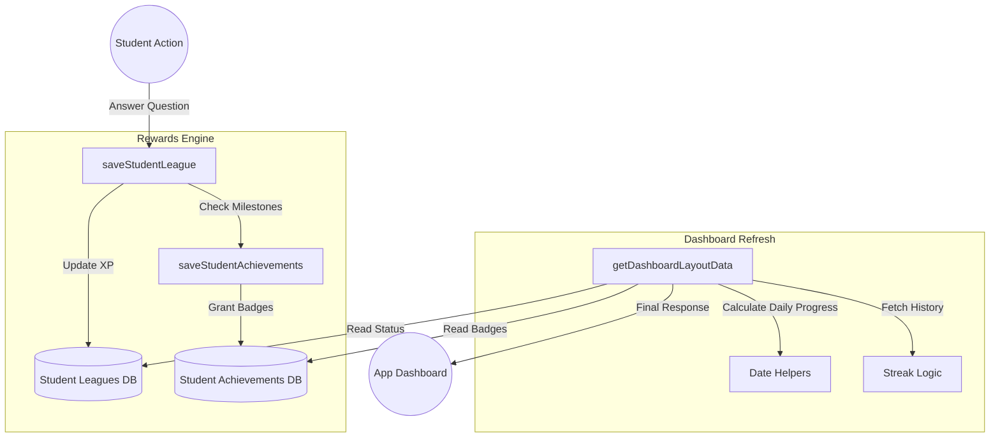

# Overall Architecture: `commonFn.utils.js`

This document explains how the various systems within `commonFn.utils.js` interact to manage student engagement, rewards, and status updates.

---

## 1. System Overview
The `commonFn.utils.js` file serves as the **Logic Core** for student-facing statistics. It is responsible for translating raw database rows into meaningful "Gamification" metrics (Streaks, Leagues, and Badges).

### The Four Pillars:
1.  **Time Logic (IST Engine):** Normalizes all global server events to Indian Standard Time to ensure daily resets happen at midnight IST.
2.  **League System:** Manages competitive rankings and XP accumulation.
3.  **Progression System:** Handles automated rewarding of Achievements/Badges.
4.  **Engagement Tracking:** Calculates "Streaks" to encourage daily usage.

---

## 2. High-Level System Flow
The diagram below shows how a single student action (answering a question) ripples through the entire utility system.

---

## 3. Data Interaction Lifecycle

### Phase A: Writing (The Mutation Flow)
When a student completes a task, the following sequence occurs:
1.  **League Update:** `saveStudentLeague` determines the current timeframe. If the answer is correct, XP is added. If wrong, XP is deducted (risk/reward).
2.  **Achievement Check:** Immediately after the XP change, `saveStudentAchievements` is called. It checks if the new `totalxp` crosses any predefined thresholds (e.g., 500 XP = "Knowledge Seeker" badge).

### Phase B: Reading (The Aggregation Flow)
When the student opens the app, `getDashboardLayoutData` orchestrates a "Big Read":
1.  It fetches the current state from Leagues and achievements.
2.  It uses the **IST Date Helpers** to look at the `studentreponse` table and determine:
    *   Did they earn XP *today*?
    *   How many days *in a row* have they earned XP?
3.  It calculates completion percentages for every subject the student is enrolled in.

---

## 4. Why This Structure?
*   **Parallelism:** The system is designed to use `Promise.all` to minimize API latency. Most dashboard metrics are fetched at the same time rather than one after another.
*   **Normalization:** By using `getIstDate` at the core, the system avoids "double-counting" or "missing days" due to the server being in a different time zone than the student.
*   **Decoupling:** The logic for *calculating* a streak is separate from the logic of *saving* an answer, allowing for flexible UI updates without heavy database writes.
