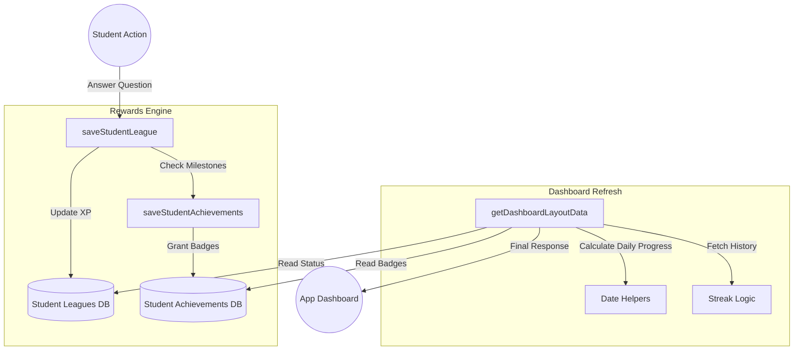

# Overall Architecture: `commonFn.utils.js`

This document provides an in-depth technical breakdown of how the various systems within `commonFn.utils.js` manage student engagement, rewards, and status data.

---

## 1. System Overview & Philosophical Design
The `commonFn.utils.js` file is the **Gamification Engine** of the platform. Its primary goal is to ensure that every student action is immediately recognized, rewarded, and reflected in their profile.

### Core Design Principles:
*   **Consistency:** Daily resets happen at exactly 00:00 IST for all users, regardless of where the physical server is located.
*   **Parallelism:** High-speed data retrieval using non-blocking asynchronous operations.
*   **Idempotency & Resilience:** Calculations like streaks are derived from raw history rather than single "counter" columns to prevent data corruption.

---

## 2. The Four Pillars (In-Depth)

### A. The IST Time Engine (Date & Time)
- **Why it exists:** Servers often run on UTC. Without normalization, a student in India might lose their streak if they solve a problem at 11:30 PM (which might already be "tomorrow" or "yesterday" on the server).
- **Key Strategy:** The system uses `CONVERT_TZ` in SQL and `getIstDate` in JS to force a unified "Calendar Day." This ensures that "Today" is the same for every student on the platform.

### B. The League System (Competition)
- **Logic:** Each league is time-bound (`fromdate` to `todate`). 
- **Mutation:** XP is the currency of the league. The `saveStudentLeague` function acts as a validator, ensuring that XP changes only happen within the active league window.
- **Risk/Reward:** The system allows for negative XP updates (penalties), ensuring that the leaderboard remains competitive.

### C. The Progression System (Achievements)
- **Milestone-Based:** Unlike XP which goes up and down, achievements are permanent.
- **Async Validation:** The achievement check runs *after* the league update to ensure the "Total XP" being checked is always the most current value.
- **Efficiency:** Uses Bulk Inserts (`VALUES ?`) to handle cases where a student might cross multiple milestones in a single session.

### D. The Engagement Engine (Streaks)
- **Derived Logic:** Instead of a simple `streak_count` column, the system fetches unique activity days and calculates the "Consecutive Count" on the fly. 
- **Benefit:** If a database write fails once, the next check will "heal" the streak based on the surrounding history.

---

## 3. High-Level System logic Flow
The diagram below shows how a single student action (answering a question) ripples through the entire utility system.



---

## 4. Database Schema Dependencies
The utility file interacts with several key tables. Understanding these relationships is critical for debugging:

| Table | Purpose | Used In |
| :--- | :--- | :--- |
| `studentdetails` | Source of truth for total XP and Hearts. | Achievements, Dashboard |
| `studentleagues` | Tracks student XP per specific league season. | saveLeague, getLeague |
| `leagues` | Defines the dates and level ranges for seasons. | getStudentLeague |
| `studentreponse` | The raw log of every question answered. | Streaks, Activity Log |
| `achievements` | The master list of badges and their XP requirements. | saveStudentAchievements |
| `subjects` / `topics` | Used to map progress to academic areas. | getDashboardLayoutData |

---

## 5. Performance Strategy: Parallel Execution
In `getDashboardLayoutData`, the system performs what is known as **Fan-Out Querying**. 

Instead of:
1. Fetch Stats -> Wait
2. Fetch Subjects -> Wait
3. Fetch Streaks -> Wait

The system triggers all queries simultaneously:
```javascript
const [stats, subjects, sectors, badges, leagues, streaks] = await Promise.all([
  queryStats(),
  querySubjects(),
  querySectors(),
  queryBadges(),
  queryLeagues(),
  queryStreaks()
]);
```
**Result:** The total load time is only as slow as the *single longest query*, rather than the sum of all queries. This is why the student dashboard feels snappy even with large amounts of data.

---

## 6. Narrative: A "Day in the Life" of a Student's Data
1.  **Login:** The student opens the app. `getDashboardLayoutData` runs. It sees the last response was 23 hours ago. It calculates `overallStreak = 5`.
2.  **Submission:** The student answers a difficult math question correctly (+15 XP).
3.  **Leagues:** `saveStudentLeague` adds +15 to their "Gold League" tally.
4.  **Achievements:** `saveStudentAchievements` notices their `totalxp` is now 1005. It checks the badges and sees the "Millennium" badge (1000 XP) hasn't been awarded yet. It inserts it.
5.  **Re-Dashboard:** The UI refreshes. The student now sees 500 XP, 6 Hearts, a 5-day streak, and a new popup for their badge. All coordinated through `commonFn.utils.js`.
